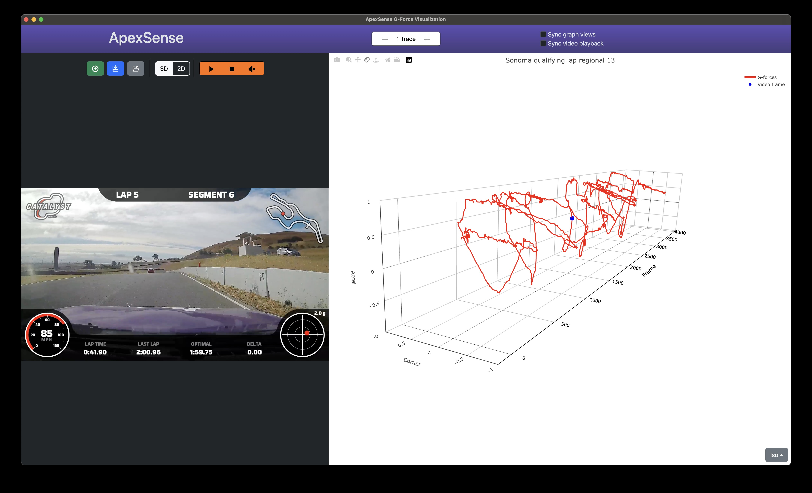
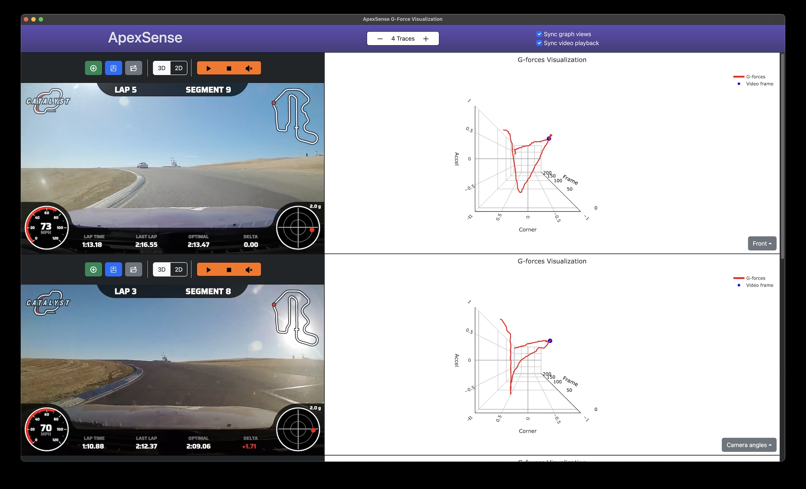
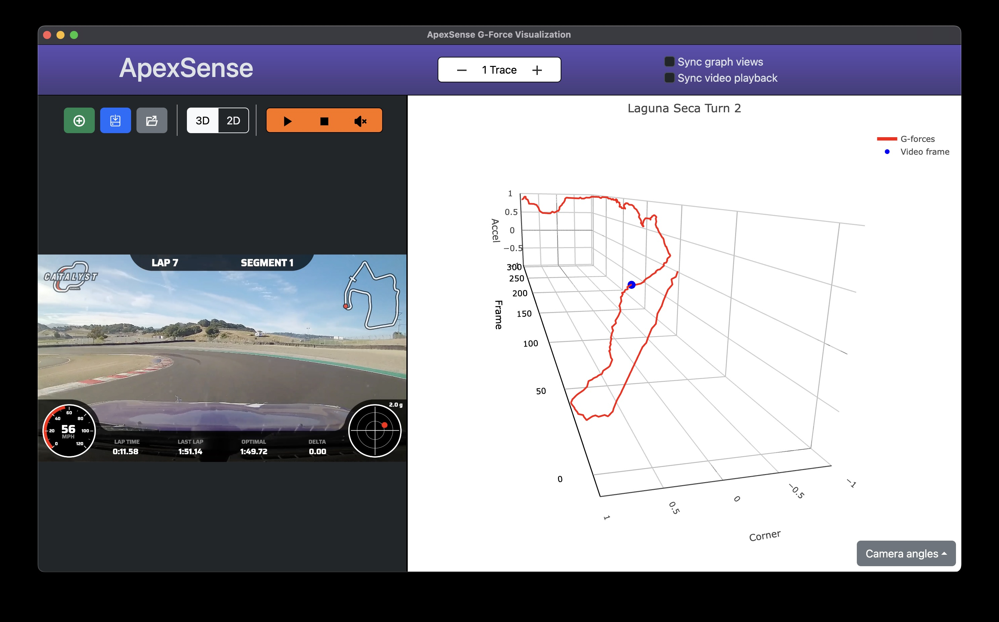
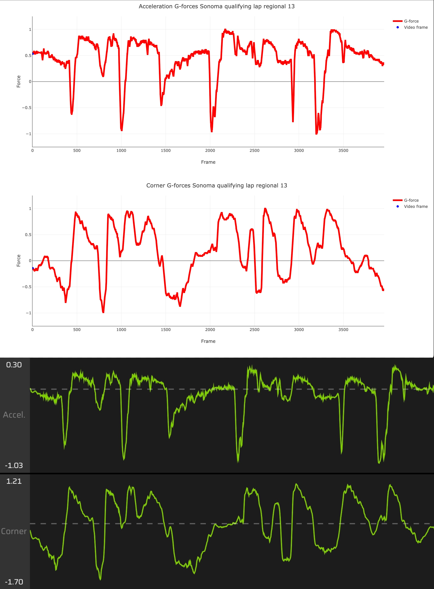
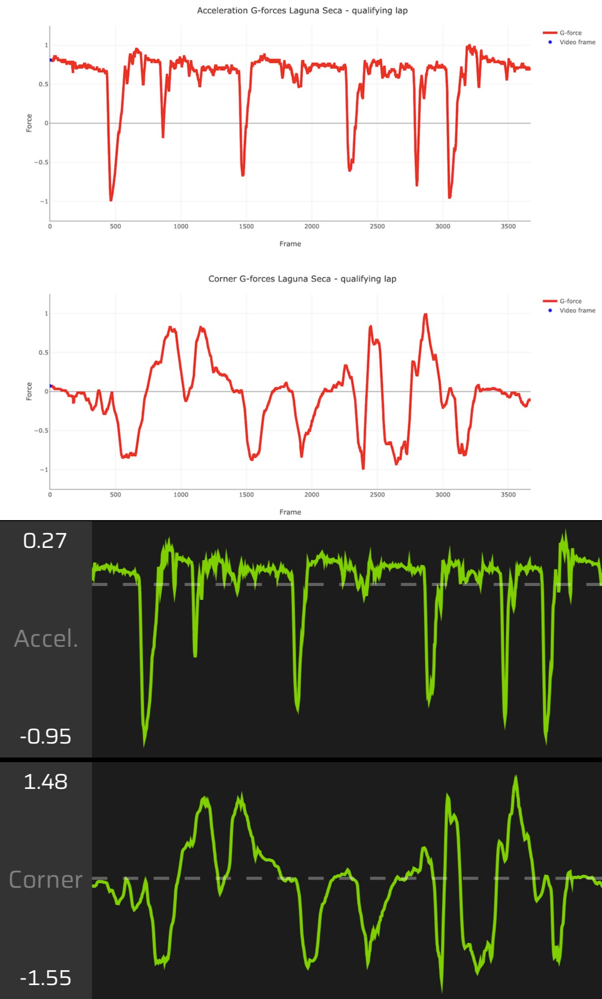

# ApexSense G-force Visualization
1. [What is ApexSense](#what-is-apexsense)
2. [Why use this](#why-use-this)
3. [Feedback](#feedback)
4. [Technical Details](#technical-details)
5. [Running from the source](#running-from-the-source)
6. [Future](#future)
7. [Disclaimer](#disclaimer)


## What is ApexSense?
ApexSense transforms your [Garmin Catalyst](https://www.garmin.com/en-US/p/690726) video data into a unique 3D visualization, revealing your driving line based on G-force dynamics, offering a deeper insight into your performance on track.



## Why use this?

High performance driving requires the driver to balance the inputs made to the car with the goal of extracting the physical limits of grip from the tire. How these inputs are provided determine how the car will enter a corner, reach the apex, and exit the corner. 

The inputs a driver makes are reflected in the G-force graphs. Understanding what the G-force graphs are showing you can help to refine your driving technique. 

If a driver drove a perfect line, only the exact amount of inputs would be provided and no more. A hypothetical graph of a perfect line would show a smooth trajectory with a proportional ratio of lateral to horizontal G-forces that never results in uncontrolled tire slip. Any deviate from a perfect line will show up in the G-force data as blips, bumps, and humps along the graph.

Lateral and horizontal G-force graphs are typically shown in two separated graphs, which makes it difficult to understand this balancing act.

ApexSense can show the relationship of all inputs the driver makes over the course of time in a single curve through 3 dimensions. With both lateral and horizontal datapoints combined, the driver can understand their technique and work to refine it. The resulting 3 dimensional curve can visualize imprecise form while trailbraking, show excessive corrections throughout a corner, and the overall trajectory of the combined inputs throughout the corner. 

With ApexSense, the driving line is reveiled to the driver not based on their physical location on track, but how the car actually moves *through* the track.

Comparing multiple video</img>

Viewing turn 2 at Laguna Seca</img>

## How to use

Supply your Catalyst videos to the application and wait for processing to complete. 

*No data you supply or generated by the tool is uploaded to, or downloaded from, the Internet. This runs locally on your computer.*

Use your mouse or trackpad to interact with the graph to rotate, zoom, and pan. Preset view options are available in the bottom right corner of the graph. Additional controls are available in the top left corner of the graph.

Use the video controls above the video to playback your video. A blue marker will travel along the graph indicating where the video corresponds with the data.

Click on a point on the graph to jump to that location in the video. 

Use the +/- buttons to add or remove rows to allow for comparing multiple videos. Use the Sync options to syncronize the playback and views amongst all videos and graphs. 

Use the Save button to save your graphs for quick lookup. Use the Load button to view your saved graphs.

You can also export your saved graphs and import them to a different computer.

### Other usage tips

Trim your Catalyst videos to specific corners for analysis. Viewing an entire lap or session can be cumbersome due to the data density. 

Ensure your Catalyst videos have not been post-processed outside of trimming the length of the video (changing resolution, colorspace, etc). This can lead to inaccurate results.


## Feedback

Feel free to open an [issue](https://github.com/shaboinkin90/ApexSense/issues/new) if you encounter problems, want to give a comment, have a question, or have a suggestion.

I find the visualized data to be invaluble for my own growth in car racing and I hope you find the same value from it. 

If you find value in this app, please consider making a donation for my time building and distributing this tool.

https://www.buymeacoffee.com/apexsense


## Technical Details

### Garmin Catalyst

Garmin does not provide the raw data generated by Catalyst. They only offer presenting the raw data through their own proprietary software. This tool gets around this problem for G-force data by using computer vision to analyze the video generated by Catalyst.

### ApexSense

ApexSense is an Electron application that processes Catalyst video using OpenCV to track the location of the G-force meter in the video overlay to develop a 3d plot of the resulting forces. The G-force data generated by ApexSense results in plots that share a high degree of similarity to what is shown in Garmin's official Catalyst app and Catalyst device. 

Top graph is from ApexSense, bottom graph is from Garmin's mobile app

Sonoma Raceway</img>


Laguna Seca</img>

### Binaries 
Binaries are produced for the systems that I have on hand to personally test on: **Apple Silicon M1 Macbook Pro** and **x86_64 Windows**. 

If you do not have such a system, leave a [feature request](https://github.com/shaboinkin90/ApexSense/issues) with information on your system setup and I'll see about producing binaries for it. Consider building the software on your system, as detailed below, if binaries are not available for your particular setup. 

#### Codesigning 
Binaries I generate are codesigned with my Apple Developer certificate for Mac or my personally generated codesigning certificate for Windows. I did not go through the process of getting this noterized by Apple, nor did I wish to acquire a 3rd party codesigning certificate for Windows - I have no idea how many people will actually use this tool and there is a cost assoicated with doing this. I am unable to noterize through Apple as the resulting pyinstaller binary does not work with Sandboxing enabled - a requirement of noterization. 

As a result, when running the prebuilt binaries, the operating system will flag the application as being "untrusted" which will require you to manually bypass the security to allow ApexSense to run. You can find instructions online for how to bypass this.

If you are uneasy about running untrusted code, feel free to clone this repository and run the tool locally.

**Mac instructions**: https://support.apple.com/en-us/HT202491

**Windows instructions**: https://support.microsoft.com/en-us/windows/add-an-exclusion-to-windows-security-811816c0-4dfd-af4a-47e4-c301afe13b26

When adding an exlucsion, you'll need to specify the path of the folder to ApexSense. 

The default installation location on Windows is:
```
    C:\Users\your-user-account\AppData\Roaming\ApexSense
```

The default location on macOS is:
```
macOS:
    Where ever you copied ApexSense.app too, /Applications/ApexSense.app

Program data is stored here:
    /Users/your-user-account/Library/Application Support/ApexSense
```


## Running from the source

This assumes basic familarity with installing software development related tools (git, cli, cloning repos, understanding your personal OS setup, etc). Leave a [comment](https://github.com/shaboinkin90/ApexSense/issues) if you need any clarification or have any questions you may have with running the software locally.

To run from the source you'll need Node and Python:

[Install Node.js for your operating system here](https://docs.npmjs.com/downloading-and-installing-node-js-and-npm)

[Install Python3 for your operating system here](https://www.python.org/downloads/)

*For Windows users*
Microsoft offers installing Python through the Windows Store: https://apps.microsoft.com/detail/9MSSZTT1N39L?hl=en-US&gl=US  


Ensure python is in your $PATH so the application can run the python script. 

After installing Python, you'll need to install two Python libraries. Run this command in your terminal to install:
```
pip3 install numpy opencv-python
```

After installing the prerequisites, clone the repository and install the node packages.

Clone repository
```
git clone git@github.com:shaboinkin90/ApexSense.git
```
Or alternatively, download a zip of the source code through Github's UI.

Navigate to the root directory of the `apexsense` repository and run:
```
npm install
```

To launch:
```
npm start
```

## Future:

I would like to expand this tool to support different data sources, like AiM, but I do not have such a device. If you would like ApexSense to support the devices you own to visualize G-forces, feel free to make a feature request containing the raw data files produced by the device and I'll see what I can do.


## Disclaimer

This software is not affiliated, associated, authorized, endorsed by, or in any way officially connected with Garmin, or any of its subsidiaries or its affiliates. The official Garmin website can be found at https://www.garmin.com/. The name Garmin, Garmin Catalyst, as well as related names, marks, emblems, and images are registered trademarks of their respective owners.